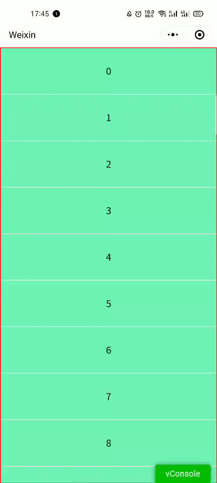

# inertial-scroll-weapp

微信小程序 - 惯性滚动

## 预览




## 使用

#### 在 json 中导入

```json
{
  "usingComponents": {
    "t-scroll": "../../components/t-scroll"
  }
}
```


#### 在 wxml 中使用

```html
<view class="page">
	<t-scroll>
		<view class="row-item" wx:for="{{ 30 }}" wx:key="item">{{ item }}</view>
	</t-scroll>
</view>
```


## 参数

| 参数       | 数据类型 | 作用               |
| ---------- | -------- | ------------------ |
| bounce     | Boolean  | 是否使用回弹效果   |
| initByHand | Boolean  | 是否手动进行初始化 |


#### initByHand

组件初始化操作会获取可视区域盒子的高度，实际内容盒子的高度。用于计算最大和最小的偏移量，当你不需要组件自动初始化或者，存在一些异步时刻时，你可以手动的进行初始化

```js
this.selectComponent('xxx').init()
```


## 参考

- [掘金惯性滚动文章](https://juejin.cn/post/6844904185121488910)

